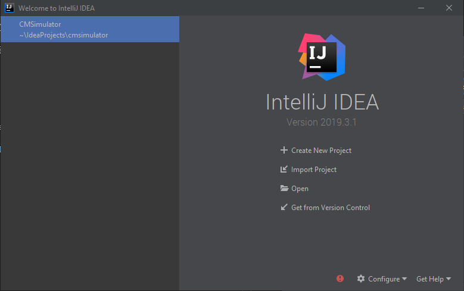
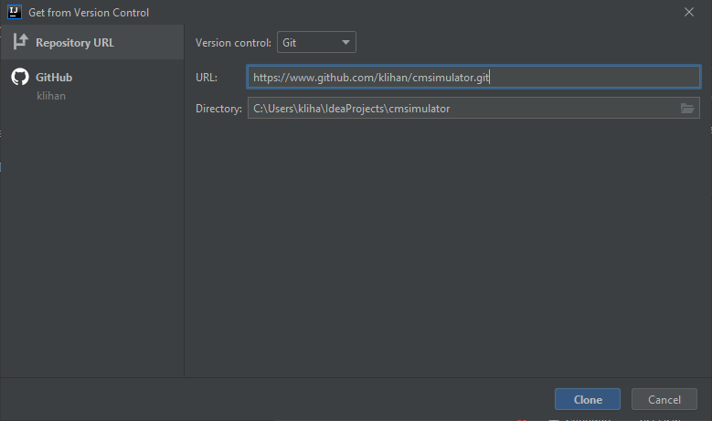
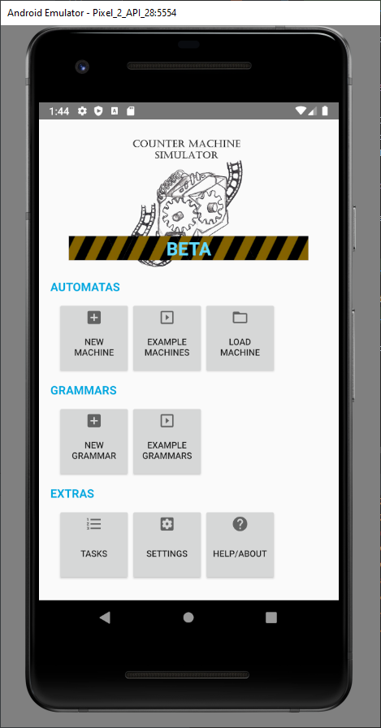
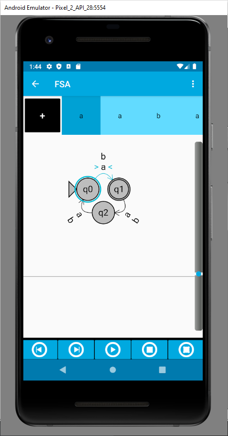
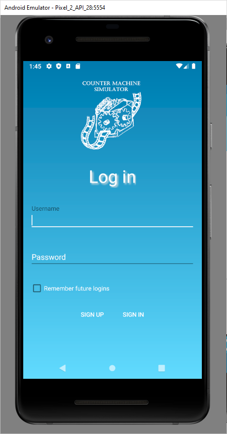
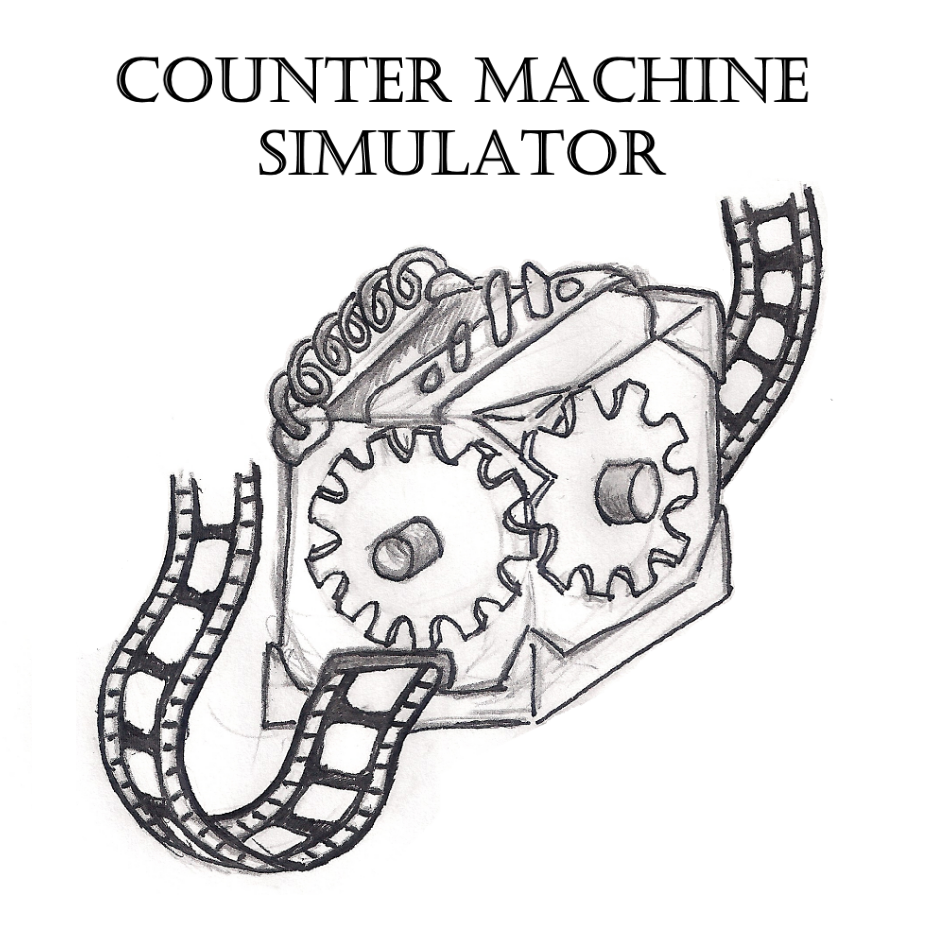

#  CMSimulator

### Version 5.0.0

CMSimulator app helps you better understand four of the most well-known abstract machines - finite state automaton, push-down automaton, linear-bounded automaton and Turing machine, You can create new or load existing solutions from files. The application also contains eight examples (one deterministic and one nondeterministic for each type of the machine).

You can create a list of symbols, states transitions rules and also choose the initial and final states. Then you can fill the tape and simulate the solution step by step, or go directly to the end of simulation. You can also mark any tape element as breakpoint to pause the simulation when the machine reaches this breakpoint.

Nondeterministic machines and solutions are also supported.

[**DEPRECATED by version 5.x.x**] Since version 3.x.x, the application also allows the creating and solving of interactive assingnmenst over the local area network. 

Since version 4.x.x, the application has been extended by simulation and visualisation of formal grammars from the Chomsky hierarchy. In CMSimulator you can create analyze and test Regular, Context-free, Context-sensitive and Unrestricted grammars. The application supports saving and loading existing grammars, as well as 4 different kinds of visualisation - Derivation table, Derivation tree, Linear derivation and Fixed derivation.

## The application was developed as part of several bachelor's projects by students of the Faculty of Informatics and Information Technologies of the Slovak University of Technology in Bratislava.
  
# GETTING STARTED

- Recommended IDE -> [Intellij IDEA](https://www.jetbrains.com/idea/)
- Built with Android SDK 27. If you wish to use 29 and higher, you have to convert your code into [AndroidX](https://developer.android.com/jetpack/androidx).
- Minimal SDK 21 (Marshmallow). Should run on about 85% of devices.

## Quick startup guide

If you have chosen to use IntelliJ IDEA, then follow this guide to get you started. Please make sure that the Android plugin, which comes preinstalled with IntelliJ IDEA is enabled.

After launching the IDE, you'll be welcomed with this screen. If not close your project from the FILE -> Close project menu. IntelliJ allows you to clone Git repository directly from this interface. Click **Get from Version Control** button.

After clicking the button, you'll be welcomed with this dialog window. According to your repo, add appropriate url. For this repo it's (http://www.github.com/klihan/cmsimualtor.git).

If you don't have SDK installed, IntelliJ can help you with that. Just create new Android project within IntelliJ IDEA and SDK installer will show up. Remember to install SDK version 27 to compile your app with. This can be done by clicking **Tools -> Android -> SDK Manager** and installing SDK version 27 while having an Android project opened!

That's it! If you are using default settings, then everything should be up and running, it works automagically. Please make sure that Gradle build has finished successfully. It may be that it has to download additional libraries to make everything work! **GOOD LUCK!**

# Screenshots

## App menu

## Example automaton

## Login activity

# KNOWN ISSUES

- Example grammars wont show after rotating the device
- Publishing new task with tests crashes the application
- BulkTestActivity shows no tasks warning despite having tests
- Minimizing app while setting up tests deletes symboles map

# TODO

- Making games work without login
- Ratings
- Game
- Manual
- Refactoring
- Testing

# Credits

## Logo designed by Adam Trizna

### Written by:
- Jakub Trizna (2015)
- Martin Gulis (2017)
- Jakub Sedlář (2018)
- Krisztian Tóth (2019)
- Kamil Lihan (2020)

### Supervised by:
- doc. Mgr. Daniela Chudá, PhD.

## ©2020 FIIT STU BRATISLAVA